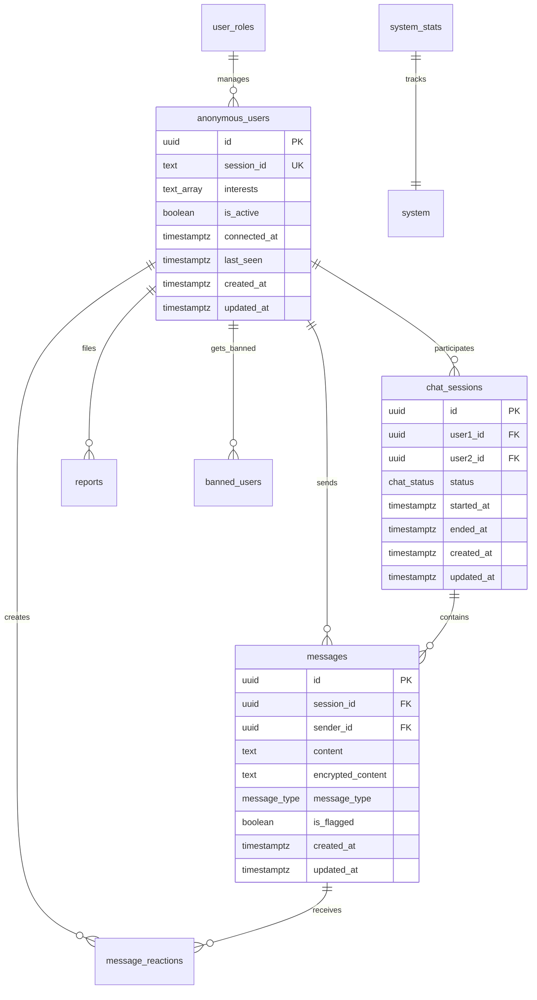

# CozyChat Database Documentation 🗃️

Complete database schema, migrations, and data management guide for CozyChat.

## Overview

CozyChat uses **PostgreSQL** with **Supabase** as the database backend, featuring:
- **Anonymous user management** with temporary sessions
- **Real-time chat functionality** with message encryption  
- **Row Level Security (RLS)** for data protection
- **Comprehensive moderation system** with reporting and banning
- **Admin role management** for platform oversight
- **Automated cleanup** and data retention policies

## Database Architecture

### Core Design Principles

1. **Privacy First**: Anonymous users with no permanent identity storage
2. **Data Protection**: RLS policies ensure users only access their own data
3. **Temporary Storage**: Automatic cleanup of old sessions and messages
4. **Scalable Design**: Optimized indexes and efficient queries
5. **Admin Oversight**: Comprehensive moderation and reporting system

### Schema Overview



## Database Schema

### Extensions and Custom Types

```sql
-- Required PostgreSQL extensions
CREATE EXTENSION IF NOT EXISTS "uuid-ossp";
CREATE EXTENSION IF NOT EXISTS "pg_trgm";

-- Custom enumeration types
CREATE TYPE chat_status AS ENUM ('waiting', 'active', 'ended');
CREATE TYPE message_type AS ENUM ('text', 'system');  
CREATE TYPE report_status AS ENUM ('pending', 'reviewed', 'resolved', 'dismissed');
CREATE TYPE user_role AS ENUM ('admin', 'moderator');
```

### Core Tables

#### `anonymous_users`
Temporary user sessions for anonymous chat participants.

```sql
CREATE TABLE anonymous_users (
    id UUID PRIMARY KEY DEFAULT uuid_generate_v4(),
    session_id TEXT UNIQUE NOT NULL,
    interests TEXT[] DEFAULT '{}',
    is_active BOOLEAN DEFAULT true,
    connected_at TIMESTAMPTZ DEFAULT NOW(),
    last_seen TIMESTAMPTZ DEFAULT NOW(),
    created_at TIMESTAMPTZ DEFAULT NOW(),
    updated_at TIMESTAMPTZ DEFAULT NOW()
);
```

**Fields:**
- `id` - Unique user identifier (UUID)
- `session_id` - Temporary session token (TEXT, unique)
- `interests` - Array of user interests for matching (TEXT[])
- `is_active` - Whether user is currently online (BOOLEAN)
- `connected_at` - Initial connection timestamp
- `last_seen` - Most recent activity timestamp
- `created_at` / `updated_at` - Record timestamps

**Indexes:**
- `idx_anonymous_users_session_id` - Fast session lookup
- `idx_anonymous_users_active` - Active users filtering
- `idx_anonymous_users_interests` - GIN index for interest matching
- `idx_anonymous_users_last_seen` - Activity-based queries

#### `chat_sessions`
Chat room instances connecting two users.

```sql
CREATE TABLE chat_sessions (
    id UUID PRIMARY KEY DEFAULT uuid_generate_v4(),
    user1_id UUID NOT NULL REFERENCES anonymous_users(id) ON DELETE CASCADE,
    user2_id UUID REFERENCES anonymous_users(id) ON DELETE CASCADE,
    status chat_status DEFAULT 'waiting',
    started_at TIMESTAMPTZ,
    ended_at TIMESTAMPTZ,
    created_at TIMESTAMPTZ DEFAULT NOW(),
    updated_at TIMESTAMPTZ DEFAULT NOW()
);
```

**Fields:**
- `id` - Unique session identifier  
- `user1_id` - First user (creator) ID
- `user2_id` - Second user (joiner) ID (NULL when waiting)
- `status` - Session state: 'waiting' | 'active' | 'ended'
- `started_at` - When chat became active (both users joined)
- `ended_at` - When chat session terminated

**Indexes:**
- `idx_chat_sessions_status` - Status-based queries
- `idx_chat_sessions_user1/user2` - User participation lookup
- `idx_chat_sessions_active` - Active session filtering

#### `messages`
Individual chat messages with encryption support.

```sql
CREATE TABLE messages (
    id UUID PRIMARY KEY DEFAULT uuid_generate_v4(),
    session_id UUID NOT NULL REFERENCES chat_sessions(id) ON DELETE CASCADE,
    sender_id UUID NOT NULL REFERENCES anonymous_users(id) ON DELETE CASCADE,
    content TEXT NOT NULL,
    encrypted_content TEXT NOT NULL,
    message_type message_type DEFAULT 'text',
    is_flagged BOOLEAN DEFAULT false,
    created_at TIMESTAMPTZ DEFAULT NOW(),
    updated_at TIMESTAMPTZ DEFAULT NOW()
);
```

**Fields:**
- `id` - Unique message identifier
- `session_id` - Parent chat session
- `sender_id` - Message author
- `content` - Plain text message content (for moderation)
- `encrypted_content` - Encrypted message content (for privacy)
- `message_type` - 'text' | 'system' (system messages for UI)
- `is_flagged` - Marked by moderation system

**Indexes:**
- `idx_messages_session` - Session-based message retrieval
- `idx_messages_sender` - User message history
- `idx_messages_flagged` - Moderation queue
- `idx_messages_content_search` - Full-text search capability

#### `message_reactions`
User reactions to messages (❤️, 😊, 👍, etc.).

```sql
CREATE TABLE message_reactions (
    id UUID PRIMARY KEY DEFAULT uuid_generate_v4(),
    message_id UUID NOT NULL REFERENCES messages(id) ON DELETE CASCADE,
    user_id UUID NOT NULL REFERENCES anonymous_users(id) ON DELETE CASCADE,
    reaction TEXT NOT NULL CHECK (reaction IN ('❤️', '😊', '👍', '😢', '😮', '😡')),
    created_at TIMESTAMPTZ DEFAULT NOW(),
    UNIQUE(message_id, user_id)
);
```

### Moderation & Admin Tables

#### `reports`
User reports for inappropriate behavior or content.

```sql
CREATE TABLE reports (
    id UUID PRIMARY KEY DEFAULT uuid_generate_v4(),
    reporter_id UUID NOT NULL REFERENCES anonymous_users(id) ON DELETE CASCADE,
    reported_user_id UUID NOT NULL REFERENCES anonymous_users(id) ON DELETE CASCADE,
    session_id UUID NOT NULL REFERENCES chat_sessions(id) ON DELETE CASCADE,
    reason TEXT NOT NULL,
    description TEXT,
    status report_status DEFAULT 'pending',
    admin_notes TEXT,
    created_at TIMESTAMPTZ DEFAULT NOW(),
    updated_at TIMESTAMPTZ DEFAULT NOW()
);
```

**Fields:**
- `reporter_id` - User filing the report
- `reported_user_id` - User being reported
- `session_id` - Chat session where incident occurred
- `reason` - Report category/reason
- `description` - Optional detailed description
- `status` - 'pending' | 'reviewed' | 'resolved' | 'dismissed'
- `admin_notes` - Internal admin comments

#### `banned_users`
Temporary and permanent user bans.

```sql
CREATE TABLE banned_users (
    id UUID PRIMARY KEY DEFAULT uuid_generate_v4(),
    user_id UUID NOT NULL REFERENCES anonymous_users(id) ON DELETE CASCADE,
    banned_by UUID NOT NULL,
    reason TEXT NOT NULL,
    expires_at TIMESTAMPTZ,
    created_at TIMESTAMPTZ DEFAULT NOW()
);
```

**Fields:**
- `user_id` - Banned user ID
- `banned_by` - Admin who issued the ban  
- `reason` - Ban justification
- `expires_at` - Ban expiration (NULL = permanent)

#### `user_roles`
Admin and moderator role assignments.

```sql
CREATE TABLE user_roles (
    id UUID PRIMARY KEY DEFAULT uuid_generate_v4(),
    user_id UUID NOT NULL,
    role user_role NOT NULL,
    assigned_by UUID NOT NULL,
    created_at TIMESTAMPTZ DEFAULT NOW(),
    UNIQUE(user_id, role)
);
```

#### `system_stats`
Daily platform usage statistics.

```sql
CREATE TABLE system_stats (
    id UUID PRIMARY KEY DEFAULT uuid_generate_v4(),
    active_users INTEGER NOT NULL DEFAULT 0,
    total_sessions INTEGER NOT NULL DEFAULT 0,
    total_messages INTEGER NOT NULL DEFAULT 0,
    recorded_at TIMESTAMPTZ DEFAULT NOW()
);
```

## Row Level Security (RLS)

CozyChat implements comprehensive RLS policies to ensure data privacy and security.

### Core Security Principles

1. **User Isolation**: Users can only access their own data
2. **Session-Based Access**: Data access tied to temporary session IDs
3. **Admin Override**: Admins can access data for moderation purposes
4. **Service Role Access**: Backend functions can perform system operations

### Key RLS Policies

#### Anonymous Users
```sql
-- Users can read their own record
CREATE POLICY "Users can read their own record" ON anonymous_users
    FOR SELECT
    USING (session_id = current_setting('app.current_user_session_id', true));

-- Users can see active users for matching (but not personal details)
CREATE POLICY "Users can see active users for matching" ON anonymous_users
    FOR SELECT
    USING (is_active = true AND id != get_user_id_from_session(...));

-- Admins can access all user records
CREATE POLICY "Admins can read all users" ON anonymous_users
    FOR ALL
    USING (is_admin(auth.uid()));
```

#### Chat Sessions
```sql
-- Users can only see sessions they participate in
CREATE POLICY "Users can see their own sessions" ON chat_sessions
    FOR SELECT
    USING (
        user1_id = get_user_id_from_session(...) 
        OR user2_id = get_user_id_from_session(...)
    );
```

#### Messages
```sql
-- Users can only see messages in their active sessions
CREATE POLICY "Users can see messages in their sessions" ON messages
    FOR SELECT
    USING (
        EXISTS (
            SELECT 1 FROM chat_sessions cs 
            WHERE cs.id = messages.session_id 
            AND (cs.user1_id = get_user_id_from_session(...) 
                OR cs.user2_id = get_user_id_from_session(...))
        )
    );

-- Users can only send messages in active sessions they're part of
CREATE POLICY "Users can send messages in their sessions" ON messages
    FOR INSERT
    WITH CHECK (
        sender_id = get_user_id_from_session(...) 
        AND EXISTS (
            SELECT 1 FROM chat_sessions cs 
            WHERE cs.id = messages.session_id 
            AND cs.status = 'active'
            AND (cs.user1_id = ... OR cs.user2_id = ...)
        )
    );
```

## Database Functions

CozyChat includes several PostgreSQL functions for complex operations.

### User Management Functions

#### `get_user_id_from_session(session_id)`
Converts session ID to user UUID for RLS policies.

#### `cleanup_old_sessions()`
Automated cleanup function that:
- Marks inactive users (last seen > 5 minutes)
- Ends sessions with inactive participants
- Deletes old users (> 24 hours)
- Removes old ended sessions (> 48 hours)
- Cleans orphaned messages

### Chat Matching Functions

#### `match_users_by_interests(user_id)`
Finds compatible users for chat matching based on:
- Shared interests (weighted by overlap)
- Active status
- Not currently banned
- Not already in active session
- Connection time (FIFO for same interest level)

```sql
SELECT au.id, au.interests
FROM anonymous_users au
WHERE au.id != user_id 
AND au.is_active = true
AND NOT EXISTS (SELECT 1 FROM banned_users WHERE user_id = au.id)
AND NOT EXISTS (SELECT 1 FROM chat_sessions WHERE (user1_id = au.id OR user2_id = au.id) AND status IN ('waiting', 'active'))
AND (user_interests IS NULL OR au.interests IS NULL OR array_length(user_interests & au.interests, 1) > 0)
ORDER BY array_length(user_interests & au.interests, 1) DESC, au.connected_at ASC
LIMIT 10;
```

#### `create_or_join_session(session_id, interests[])`
Main chat matching function that:
1. Validates user exists and isn't banned
2. Updates user activity and interests
3. Looks for compatible waiting sessions
4. Either joins existing session or creates new waiting session
5. Returns session UUID

### Moderation Functions

#### `report_user(reporter_session, reported_user, session, reason, description)`
Creates moderation report with validation:
- Verifies reporter is part of the session
- Links report to specific chat session
- Returns report ID for tracking

#### `end_chat_session(session_id, user_session_id)`
Safely ends chat session with validation:
- Verifies user is participant in session
- Updates session status and timestamp
- Returns success boolean

### Analytics Functions

#### `record_daily_stats()`
Records daily platform statistics:
- Active user count
- Sessions created today
- Messages sent today

## Indexes and Performance

### Performance Optimization Strategy

1. **Query-Specific Indexes**: Covering common query patterns
2. **Composite Indexes**: Multi-column indexes for complex filters  
3. **Partial Indexes**: Only indexing relevant rows (e.g., active users)
4. **GIN Indexes**: Array operations (interests) and full-text search
5. **Covering Indexes**: Including all needed columns to avoid table lookups

### Critical Indexes

```sql
-- Anonymous Users
CREATE INDEX idx_anonymous_users_active ON anonymous_users(is_active) WHERE is_active = true;
CREATE INDEX idx_anonymous_users_interests ON anonymous_users USING gin(interests);

-- Chat Sessions  
CREATE INDEX idx_chat_sessions_active ON chat_sessions(status, created_at) WHERE status IN ('waiting', 'active');

-- Messages
CREATE INDEX idx_messages_session ON messages(session_id, created_at);
CREATE INDEX idx_messages_content_search ON messages USING gin(to_tsvector('english', content));

-- Reports
CREATE INDEX idx_reports_status ON reports(status, created_at) WHERE status = 'pending';
```

## Data Retention and Cleanup

### Automatic Cleanup Policies

CozyChat implements aggressive data cleanup to protect user privacy:

1. **Inactive Users**: Marked inactive after 5 minutes of inactivity
2. **Old Users**: Deleted after 24 hours (CASCADE deletes all related data)
3. **Ended Sessions**: Deleted after 48 hours  
4. **Orphaned Messages**: Cleaned up when parent session is deleted
5. **Expired Bans**: Automatically lifted when `expires_at` passes

### Manual Data Management

```sql
-- Force cleanup old data (run via cron or scheduled function)
SELECT cleanup_old_sessions();

-- Get current platform statistics
SELECT 
    COUNT(*) as total_users,
    COUNT(*) FILTER (WHERE is_active = true) as active_users
FROM anonymous_users;

SELECT 
    status,
    COUNT(*) as session_count
FROM chat_sessions 
GROUP BY status;

-- Admin queries for moderation
SELECT * FROM reports WHERE status = 'pending' ORDER BY created_at;
SELECT COUNT(*) FROM messages WHERE is_flagged = true;
```

## Migration Management

### Migration Files

1. **001_initial_schema.sql**: Core tables, indexes, and triggers
2. **002_rls_policies.sql**: Row Level Security policies and helper functions  
3. **003_functions.sql**: Business logic functions for chat operations

### Running Migrations

```bash
# Local development (with Supabase CLI)
supabase db push

# Production (via Supabase Dashboard or API)  
# Upload migration files to Supabase Dashboard → SQL Editor → Run
```

### Migration Best Practices

1. **Incremental Changes**: Each migration builds on previous ones
2. **Rollback Strategy**: Include rollback instructions for each migration
3. **Data Validation**: Test migrations on staging environment first
4. **Performance Impact**: Consider index creation time for large tables
5. **RLS Testing**: Verify RLS policies work correctly after changes

## Backup and Recovery

### Supabase Automated Backups

- **Point-in-Time Recovery**: Available for paid plans (up to 7 days)
- **Daily Backups**: Automatic daily snapshots
- **Cross-Region Replication**: Available for enterprise plans

### Manual Backup Strategy

```sql
-- Export user data (for GDPR compliance)
COPY (
    SELECT au.id, au.created_at, au.interests, 
           array_agg(m.content ORDER BY m.created_at) as messages
    FROM anonymous_users au
    LEFT JOIN messages m ON au.id = m.sender_id
    WHERE au.session_id = 'user_session_to_export'
    GROUP BY au.id, au.created_at, au.interests
) TO '/path/to/user_data.csv' WITH CSV HEADER;

-- Cleanup specific user data (right to be forgotten)
DELETE FROM anonymous_users WHERE session_id = 'user_session_to_delete';
-- CASCADE will automatically delete all related messages, reports, etc.
```

## Security Considerations

### Data Encryption

1. **In Transit**: All communication over HTTPS/WSS
2. **At Rest**: Supabase provides database encryption at rest
3. **Application Level**: Messages stored with encrypted content for additional privacy
4. **Session Tokens**: Temporary, expire automatically

### Access Control

1. **RLS Policies**: Comprehensive row-level security
2. **API Key Management**: Separate anon/service role keys
3. **Admin Authentication**: Full Supabase Auth integration
4. **Rate Limiting**: Built into Supabase and application layer

### Monitoring and Alerting

```sql
-- Monitor suspicious activity
SELECT 
    reporter_id,
    COUNT(*) as report_count,
    array_agg(DISTINCT reason) as reasons
FROM reports 
WHERE created_at > NOW() - INTERVAL '1 hour'
GROUP BY reporter_id
HAVING COUNT(*) > 5;

-- Check for banned users attempting access
SELECT COUNT(*) 
FROM banned_users 
WHERE expires_at > NOW() OR expires_at IS NULL;

-- Monitor message volume for spam detection
SELECT 
    sender_id,
    COUNT(*) as message_count,
    COUNT(DISTINCT session_id) as unique_sessions
FROM messages 
WHERE created_at > NOW() - INTERVAL '10 minutes'
GROUP BY sender_id
HAVING COUNT(*) > 50;
```

## Troubleshooting

### Common Issues

**1. RLS Policy Errors**
```sql
-- Test RLS policies by setting session context
SELECT set_config('app.current_user_session_id', 'test_session_123', true);
SELECT * FROM anonymous_users; -- Should only return user's own record
```

**2. Performance Issues**
```sql
-- Analyze query performance
EXPLAIN ANALYZE SELECT * FROM messages WHERE session_id = 'uuid';

-- Check index usage
SELECT schemaname, tablename, indexname, idx_scan, idx_tup_read, idx_tup_fetch 
FROM pg_stat_user_indexes 
ORDER BY idx_scan DESC;
```

**3. Connection Limits**
```sql
-- Monitor connection usage
SELECT count(*) FROM pg_stat_activity;
SELECT * FROM pg_stat_activity WHERE state = 'active';
```

**4. Storage Usage**
```sql
-- Check table sizes
SELECT 
    schemaname as table_schema,
    tablename as table_name,
    pg_size_pretty(pg_total_relation_size(schemaname||'.'||tablename)) as size,
    pg_total_relation_size(schemaname||'.'||tablename) as size_bytes
FROM pg_tables 
WHERE schemaname = 'public'
ORDER BY pg_total_relation_size(schemaname||'.'||tablename) DESC;
```

---

## Quick Reference

### Essential Queries

```sql
-- Get active user count
SELECT COUNT(*) FROM anonymous_users WHERE is_active = true;

-- Get waiting sessions
SELECT * FROM chat_sessions WHERE status = 'waiting';

-- Get recent reports
SELECT * FROM reports WHERE status = 'pending' ORDER BY created_at DESC;

-- Cleanup old data manually
SELECT cleanup_old_sessions();

-- Check if user is admin  
SELECT is_admin('user-uuid-here');

-- Match users by interests
SELECT * FROM match_users_by_interests('user-uuid-here');
```

### Useful Admin Commands

```sql
-- Ban a user temporarily (24 hours)
INSERT INTO banned_users (user_id, banned_by, reason, expires_at)
VALUES ('user-uuid', 'admin-uuid', 'Inappropriate behavior', NOW() + INTERVAL '24 hours');

-- Resolve a report
UPDATE reports 
SET status = 'resolved', admin_notes = 'User warned and behavior corrected'
WHERE id = 'report-uuid';

-- Get daily stats
SELECT * FROM system_stats WHERE DATE(recorded_at) = CURRENT_DATE;
```

The CozyChat database is designed for privacy, scalability, and ease of moderation. All data structures support the anonymous, temporary nature of the chat platform while providing comprehensive tools for platform management and user safety. 🛡️
